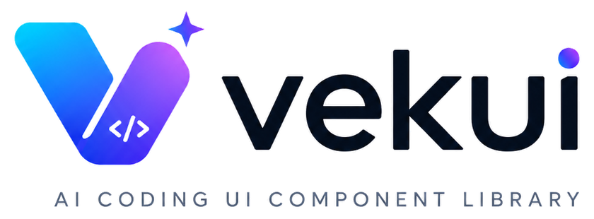

<p align="center">
  
</p>

<p align="center">
  Source-first UI registry for Taro React WeChat mini programs.
</p>

<p align="center">
  <a href="https://github.com/vekui/weapp/stargazers"></a>
  <a href="https://github.com/vekui/weapp/network/members"></a>
  <a href="https://github.com/vekui/weapp/actions/workflows/ci.yml"></a>
  <a href="LICENSE"></a>
  <a href="https://vekui.github.io/weapp"></a>
  <a href="https://vekui.github.io/weapp/r/index.json"></a>
  <a href="https://vekui.github.io/weapp/components"></a>
  <a href="https://taro.zone"></a>
  <a href="https://pnpm.io"></a>
</p>

<p align="center">
  <a href="README.zh-CN.md">简体中文</a>
  ·
  <a href="https://vekui.github.io/weapp">Documentation</a>
  ·
  <a href="CHANGELOG.md">Changelog</a>
</p>

# VekUI WeApp

VekUI WeApp is a shadcn-style source registry and first-party UI foundation for
Taro React WeChat mini programs. Instead of asking application teams to depend
on an opaque component package forever, VekUI installs component source, design
tokens, primitives, and local utilities into your own project through the
`vekui` CLI.

The result is a UI layer that feels familiar to shadcn/ui users while staying
inside the constraints of WeChat mini programs: Taro primitives, WXSS-safe
utilities, semantic tokens, app-tree overlays, and no browser DOM assumptions.

## Why VekUI

- **Source ownership**: components are copied into your app, so product teams can
  audit, edit, and version them with the rest of their codebase.
- **Mini-program native constraints**: shared UI is built on `@tarojs/components`
  rather than browser DOM nodes, portals, Radix primitives, or ReactDOM.
- **Semantic styling**: components use token utilities such as `bg-background`,
  `text-foreground`, `bg-primary`, and `border-border` instead of raw colors.
- **Registry-driven distribution**: the public registry describes component
  files, dependencies, registry dependencies, and token/style assets.
- **Runtime verification path**: `apps/miniprogram` is a real Taro playground for
  validating component behavior in the WeChat mini-program toolchain.
- **Contributor guardrails**: repository scripts check UI boundaries, component
  contracts, Tailwind utility safety, registry output, docs, and builds.

## Status

VekUI WeApp is in the initial `0.x` phase. The current registry exposes 95
public UI components plus shared registry items for styles, primitives, layer
rendering, state helpers, variants, and the `cn` utility.

The recommended v0 distribution model is the source registry, not a traditional
black-box npm component package.

## Project Metadata

| Item | Value |
| --- | --- |
| Repository | [`vekui/weapp`](https://github.com/vekui/weapp) |
| License | [MIT](LICENSE) |
| Docs | <https://vekui.github.io/weapp> |
| Registry | 101 items at <https://vekui.github.io/weapp/r/index.json> |
| Public UI components | 95 registry components |
| Runtime target | Taro React WeChat mini programs |
| Taro version | `4.2.0` |
| React version | `18.3.1` |
| Package manager | `pnpm@10.0.0` |
| CI | [`CI`](https://github.com/vekui/weapp/actions/workflows/ci.yml) |

## Quick Start

Run these commands from the root of an existing Taro React WeChat mini-program
project:

```bash
pnpm dlx vekui init --cwd . --yes
pnpm dlx vekui add button input --cwd .
```

`init` creates the local VekUI project contract:

- `vekui.json`
- `src/lib/cn.ts`
- `src/styles/vekui.css`

`add` reads the registry, resolves `registryDependencies`, and writes component
source files into the configured `aliases.components` directory.

After installing components, import the generated token CSS from your app's
global style entry:

```css
@import "./styles/vekui.css";
```

Then run the project check:

```bash
pnpm dlx vekui doctor --cwd .
```

## Requirements

- Taro React WeChat mini-program project
- Taro Vite compiler for mini-program builds
- React 18
- `pnpm` or a compatible package workflow
- A global CSS entry that can import the generated VekUI token file

## CLI

The CLI package and command are both named `vekui`.

```bash
pnpm dlx vekui init --cwd . --yes
pnpm dlx vekui add button input --cwd .
pnpm dlx vekui list
pnpm dlx vekui doctor --cwd .
```

| Command | Purpose |
| --- | --- |
| `init` | Create `vekui.json`, token CSS, the `cn` utility, and default aliases. |
| `add` | Install component source from the registry into the target project. |
| `list` | Print the public registry items available for installation. |
| `doctor` | Check project setup, CSS entry, imports, and mini-program compatibility risks. |

## Generated Project Shape

The default generated configuration targets this structure:

```text
src/
  components/ui/
  lib/
  styles/
```

Default `vekui.json`:

```json
{
  "schema": "https://vekui.github.io/weapp/r/schema.json",
  "style": "default",
  "tsx": true,
  "tailwind": {
    "css": "src/styles/vekui.css"
  },
  "aliases": {
    "components": "src/components/ui",
    "lib": "src/lib",
    "styles": "src/styles"
  }
}
```

## Registry

The registry is generated from
[`packages/registry/src/manifest.ts`](packages/registry/src/manifest.ts). Public
JSON is published under the docs site:

- `https://vekui.github.io/weapp/r/index.json`
- `https://vekui.github.io/weapp/r/button.json`

Each item follows a shadcn-compatible shape with:

- `name`
- `type`
- `title`
- `description`
- `dependencies`
- `registryDependencies`
- `files`

Build the registry locally with:

```bash
pnpm registry:build
```

## Components

All shared UI source lives in [`packages/ui`](packages/ui). Components are
implemented with Taro primitives, semantic token classes, local state helpers,
and small shared primitives.

Examples of registry components include:

- Actions and overlays: `action-sheet`, `alert-dialog`, `dialog`, `drawer`,
  `dropdown-menu`, `popover`, `sheet`, `toast`, `tooltip`
- Form controls: `button`, `checkbox`, `combobox`, `date-picker`, `input`,
  `input-number`, `native-select`, `radio-group`, `select`, `slider`, `switch`,
  `textarea`
- Data and layout: `accordion`, `card`, `data-list`, `data-table`, `flex`,
  `grid`, `list`, `pagination`, `table`, `tabs`
- Feedback and display: `alert`, `avatar`, `badge`, `empty`, `loading`,
  `progress`, `skeleton`, `spinner`, `steps`, `tag`, `typography`

Use the CLI to view the full list:

```bash
pnpm dlx vekui list
```

## Repository Layout

```text
apps/
  docs/          Next/Nextra documentation site and public registry output
  miniprogram/   Taro React WeChat mini-program playground
packages/
  cli/           vekui CLI: init, add, list, doctor
  registry/      shadcn-compatible registry builder and manifest
  ui/            canonical shared UI source, tokens, primitives, and tests
docs/
  DEVELOPER_GUIDE.md
  TEST_PLAN.md
  UI_RULES.md
```

Important boundaries:

- Treat `packages/ui` as the canonical source for shared UI.
- Use `apps/miniprogram` only as a playground and runtime verification app.
- Use `packages/registry` as the public registry contract.
- Keep docs, registry metadata, playground demos, and tests in sync when adding
  or changing public components.

## Local Development

Install dependencies:

```bash
pnpm install
```

Common commands:

```bash
pnpm dev:docs
pnpm dev:miniprogram
pnpm typecheck
pnpm test
pnpm check:ui
pnpm registry:build
pnpm build:miniprogram
pnpm build:docs
```

`check:ui` runs the repository-specific UI guardrails:

- `check:ui:boundaries`
- `check:ui:components`
- `check:ui:tailwind`

## Mini-Program Compatibility Rules

Shared UI must stay compatible with the Taro WeChat mini-program runtime.

Allowed patterns:

- Use `@tarojs/components` primitives.
- Use semantic token utilities and mini-program-safe Tailwind utilities.
- Reflect state through `data-state`, `data-disabled`, `data-invalid`, or
  `data-loading` where relevant.
- Prefer touch targets of at least `88rpx`.

Forbidden patterns inside `packages/ui`:

- `@radix-ui/*`
- `@nutui/*`, `antd-mobile`, `vant`, `taro-ui`, or other third-party UI
  component libraries as fallbacks
- `lucide-react`
- `window`, `document`, `ReactDOM`, `HTMLElement`, browser portals, or browser
  DOM APIs
- Raw hex colors in component class strings
- `space-x-*`, `space-y-*`, or `translate-*` utilities in shared components
- Hover-only, right-click-only, or desktop menu-bar interactions

See [`docs/UI_RULES.md`](docs/UI_RULES.md) for the full rule set.

## Testing And Verification

Run the full verification suite before reporting completion:

```bash
pnpm typecheck
pnpm test
pnpm check:ui
pnpm registry:build
pnpm build:miniprogram
pnpm build:docs
```

Component tests should cover public API behavior, state attributes, semantic
token classes, and mini-program compatibility rules. Manual verification should
use the Taro playground in WeChat Developer Tools.

See [`docs/TEST_PLAN.md`](docs/TEST_PLAN.md) for the detailed checklist.

## Contributing

For public UI work, keep the whole distribution chain closed:

1. Update `packages/registry/src/manifest.ts`.
2. Implement component source in `packages/ui`.
3. Add tests for API, state attributes, token classes, and compatibility rules.
4. Add or update playground demos in `apps/miniprogram`.
5. Update docs and changelog entries.
6. Run the full verification suite.

Read the project context before making larger changes:

- [`docs/DEVELOPER_GUIDE.md`](docs/DEVELOPER_GUIDE.md)
- [`docs/UI_RULES.md`](docs/UI_RULES.md)
- [`docs/TEST_PLAN.md`](docs/TEST_PLAN.md)
- [`AGENTS.md`](AGENTS.md)

## Documentation

- Documentation site: <https://vekui.github.io/weapp>
- Registry index: <https://vekui.github.io/weapp/r/index.json>
- Changelog: [`CHANGELOG.md`](CHANGELOG.md)

## License

MIT. See [`LICENSE`](LICENSE).

## WeChat Official Account

<p align="center">
  <strong>关注公众号 · Follow the official account for VekUI WeApp and mini-program UI updates.</strong>
</p>

<p align="center">
  
</p>
